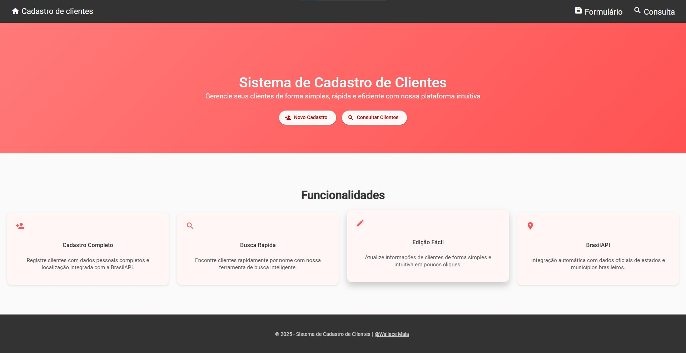
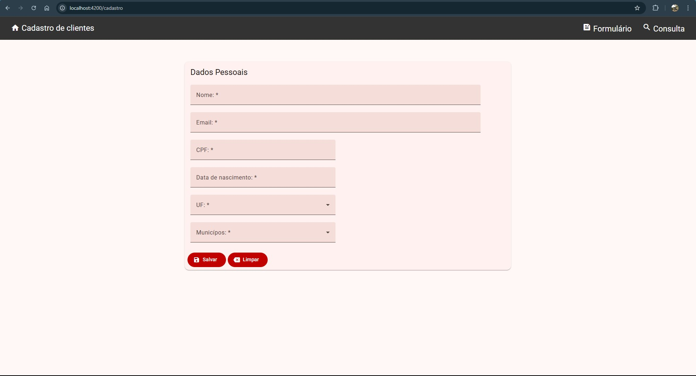
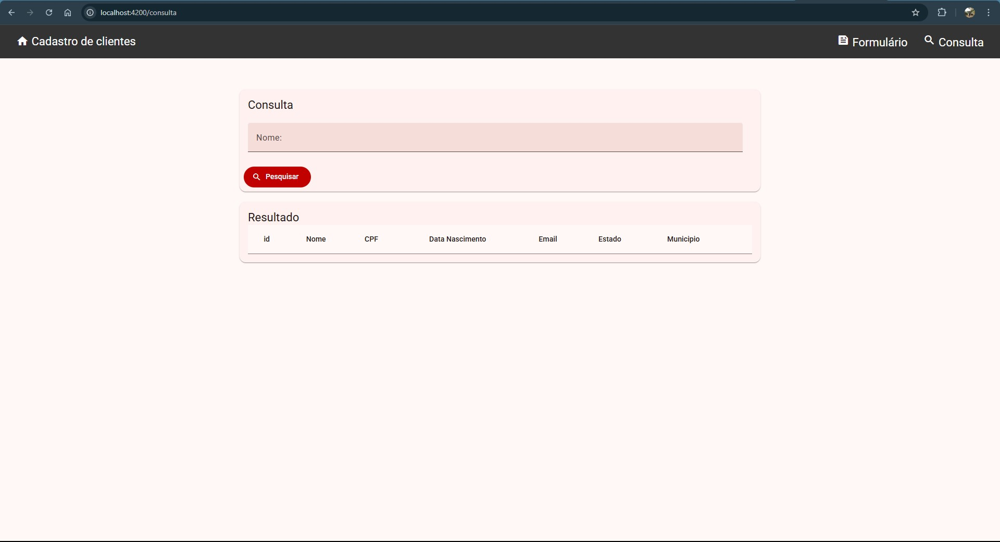
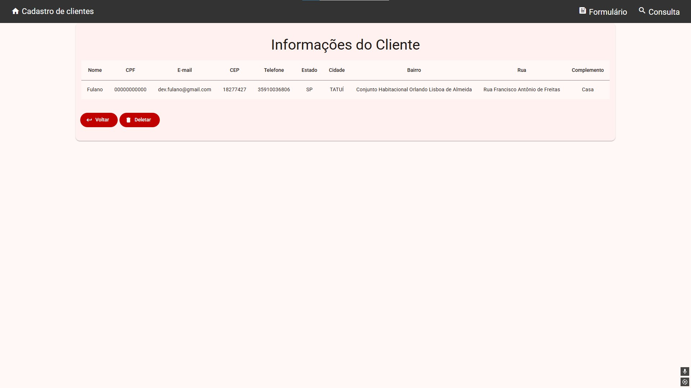

# 📋 Sistema de Cadastro de Clientes

Sistema web moderno para gerenciamento completo de cadastro de clientes, desenvolvido com Angular e integrado à BrasilAPI para validação automática de localização.

## 🚀 Tecnologias

### Core
- **Angular 19** - Framework JavaScript progressivo com arquitetura standalone components
- **TypeScript** - Superset JavaScript com tipagem estática
- **Angular Material** - Biblioteca de componentes UI baseada em Material Design
- **RxJS** - Biblioteca para programação reativa com Observables

### Recursos Avançados
- **SSR (Server-Side Rendering)** - Renderização no servidor com Angular Universal
- **Angular Flex Layout** - Sistema de layout flexível e responsivo
- **Reactive Forms** - Validação e manipulação de formulários com two-way binding
- **Routing** - Sistema de navegação SPA (Single Page Application)

### Integrações e Bibliotecas
- **BrasilAPI** - Integração para dados oficiais de CEP, estados e municípios
- **UUID (v4)** - Geração de identificadores únicos universais
- **ngx-mask** - Máscaras para formatação de CPF, telefone e data
- **LocalStorage API** - Persistência de dados no navegador

## ✨ Funcionalidades

- ✅ Cadastro completo de clientes com validação de campos
- 🔍 Busca e filtro de clientes por nome
- ✏️ Edição e atualização de registros
- 🗑️ Exclusão de clientes com confirmação
- 📍 Busca automática de endereço via CEP
- 🌎 Seleção de estado e município com dados da BrasilAPI
- 💾 Armazenamento local persistente
- 📱 Interface responsiva e moderna

## 🛠️ Arquitetura

```
src/app/
├── cadastro/              # Módulo de cadastro/edição
│   ├── cadastro.ts       # Component principal
│   └── cliente.ts        # Model de dados
├── consulta/              # Módulo de listagem e busca
├── informacoes/           # Detalhes completos do cliente
├── home/                  # Página inicial
├── brasilapi-service.ts   # Serviço de integração API
├── cliente-service.ts     # Lógica de negócio
└── app.routes.ts         # Configuração de rotas
```

## 🎯 Destaques Técnicos

**Angular Moderno**
- Standalone Components (sem NgModules)
- Signals para reatividade
- Injeção de dependências
- Lifecycle hooks otimizados

**Boas Práticas**
- Separação de responsabilidades (Services, Components, Models)
- Componentes reutilizáveis e modulares
- Validação completa de formulários
- Tratamento de erros com feedback visual

**UX/UI**
- Design responsivo mobile-first
- Feedback instantâneo com Snackbar
- Máscaras de entrada intuitivas
- Confirmação de ações destrutivas

## 🔧 Como Executar

```bash
# Instalar dependências
npm install

# Desenvolvimento
npm start
# Acesse http://localhost:4200

# Build de produção
npm run build

# Executar com SSR
npm run serve:ssr:customer-register
```

## 📱 Páginas

- **`/home`** - Landing page com apresentação do sistema
- **`/cadastro`** - Formulário de cadastro e edição
- **`/consulta`** - Listagem e busca de clientes
- **`/informacoes`** - Visualização detalhada do cliente

## 📸 Demonstração

### 🏠 Página Inicial
<div align="center">
  
</div>

### 📝 Formulário de Cadastro
<div align="center">
  
</div>

### 🔍 Consulta de Clientes
<div align="center">
  
</div>

### 🔍 Informações do Cliente
<div align="center">
  
</div>

## 👨‍💻 Desenvolvedor

<div align="center">
  
  
  **Wallace Maia**  
  *Full Stack Developer | Java • Angular • Spring Boot*
  
  [](https://www.linkedin.com/in/wallacemaia-dev/)
  [](https://github.com/wallacemaia2007)
  [](mailto:wallacemaia2007@gmail.com)
</div>

---

<div align="center">
  
**⚠️ Nota**: Este projeto utiliza LocalStorage para fins de demonstração. Para ambientes de produção, recomenda-se integração com API REST e banco de dados.

</div>
