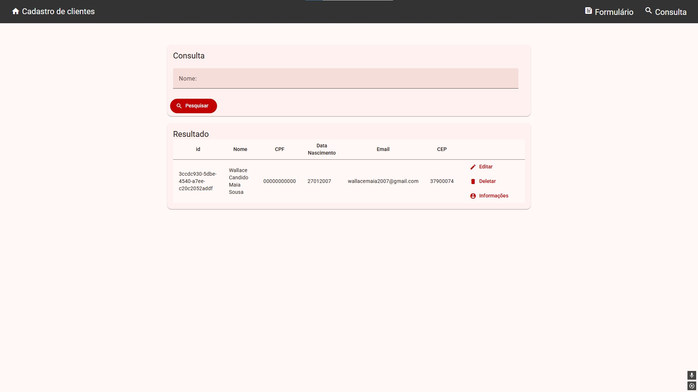

# 📋 Sistema de Cadastro de Clientes

Sistema web desenvolvido em Angular para gerenciamento de cadastro de clientes com integração à BrasilAPI para dados de localização.


## 🚀 Tecnologias Utilizadas

### Frontend

- **Angular 19+** - Framework principal
- **TypeScript** - Linguagem de programação
- **Angular Material** - Biblioteca de componentes UI
- **Angular Flex Layout** - Sistema de layout responsivo
- **RxJS** - Programação reativa

### Funcionalidades Técnicas

- **SSR (Server-Side Rendering)** - Renderização no servidor com Angular SSR
- **Standalone Components** - Arquitetura moderna do Angular
- **Reactive Forms** - Template-driven forms com two-way binding
- **Routing** - Navegação entre páginas
- **LocalStorage** - Persistência de dados no navegador
- **HTTP Client** - Requisições para APIs externas

### APIs e Integrações

- **BrasilAPI** - Integração para dados de estados e municípios brasileiros
- **UUID (v4)** - Geração de identificadores únicos
- **ngx-mask** - Máscaras para CPF e data de nascimento

## 📦 Funcionalidades

- ✅ Cadastro completo de clientes (nome, email, CPF, data de nascimento, estado e município)
- 🔍 Busca e consulta de clientes por nome
- ✏️ Edição de dados cadastrados
- 🗑️ Exclusão de registros
- 📍 Seleção de estado e município integrada com BrasilAPI
- 💾 Persistência local dos dados (LocalStorage)
- 🎨 Interface moderna com Angular Material

## 🛠️ Estrutura do Projeto

```
src/app/
├── cadastro/          # Módulo de cadastro de clientes
├── consulta/          # Módulo de consulta e listagem
├── home/              # Página inicial
├── brasilapi-service  # Serviço de integração com BrasilAPI
├── cliente-service    # Serviço de gerenciamento de clientes
└── app.routes         # Configuração de rotas
```

## 🎯 Competências Demonstradas

### Angular

- Componentes standalone
- Services com injeção de dependência
- Reactive programming com Observables
- Roteamento e navegação
- Template-driven forms
- Two-way data binding
- Lifecycle hooks (OnInit)
- Query parameters

### TypeScript

- Tipagem estática
- Interfaces e classes
- Métodos estáticos
- Optional chaining

### Arquitetura

- Separação de responsabilidades (Components, Services, Models)
- Organização modular do código
- Padrão de Service para lógica de negócio
- Componentização reutilizável

### UX/UI

- Design responsivo
- Feedback visual (Snackbar)
- Validação de formulários
- Máscaras de input
- Confirmação de ações destrutivas

## 🔧 Como Executar

```bash
# Instalar dependências
npm install

# Executar em desenvolvimento
npm start

# Build para produção
npm run build

# Executar com SSR
npm run serve:ssr:customer-register
```

## 📱 Páginas

- **Home** (`/home`) - Página inicial com apresentação do sistema
- **Cadastro** (`/cadastro`) - Formulário de cadastro/edição de clientes
- **Consulta** (`/consulta`) - Listagem e busca de clientes

---

## 📸 Screenshots

### 🏠 Página Inicial

<div >

<div align="center">
  
</div>

---

### 📝 Formulário de Cadastro

<div align="center">
  
</div>

---

### 🔍 Consulta de Clientes

<div align="center">
  
</div>
</div>


## 👨‍💻 Autor

<div align="center">
  
  
  **Wallace Maia**  
  *Desenvolvedor Full Stack Java/Angular*
  
  [](https://www.linkedin.com/in/wallacemaia-dev/)
  [](https://github.com/wallacemaia2007)
  [](mailto:wallacemaia2007@gmail.com)
</div>

---

**Nota**: Este projeto utiliza LocalStorage para persistência de dados. Em produção, recomenda-se integração com API backend e banco de dados.
